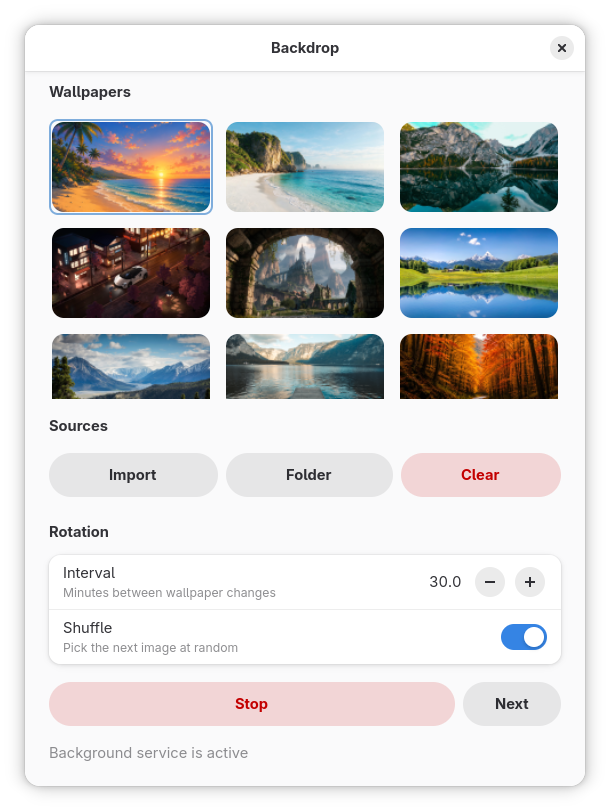

# Backdrop

Minimal wallpaper rotator for Linux. GTK4 / libadwaita UI and a background daemon that keeps rotating after you close the window (optional systemd `--user` service).

**App ID:** `io.nexol.Backdrop` · **Author:** Dmytro · **Contact:** dmytro@nexol.io · **Site:** [nexol.io](https://nexol.io)



## Features

- Import images (copied under `~/.local/share/backdrop/wallpapers/`, deduped by SHA-256) or add folders by path
- Interval rotation with optional shuffle
- Common desktops: GNOME / Cinnamon / MATE, KDE Plasma, Sway, `feh`, and related fallbacks
- Daemon signals: `SIGUSR1` next, `SIGHUP` reload config, `SIGTERM` stop
- UI follows system locale (English source strings; Ukrainian in `po/uk.po`)

## Build

Dependencies (Fedora):

```bash
sudo dnf install cmake gcc-c++ pkgconf-pkg-config \
  gtk4-devel libadwaita-devel glib2-devel gettext
```

```bash
cmake -S . -B build -DCMAKE_BUILD_TYPE=Release
cmake --build build
./build/backdrop
```

Or `make`. Daemon only: `./build/backdrop --daemon`.

## Install

```bash
sudo ./scripts/install.sh      # PREFIX=/usr/local
sudo ./scripts/uninstall.sh    # also removes ~/.local/share/backdrop and ~/.config/backdrop
```

RPM / Flatpak / DESTDIR: see `BUILD.txt`.

## Config

| Path | Role |
|------|------|
| `~/.config/backdrop/config.json` | settings |
| `~/.local/share/backdrop/wallpapers/` | imported images |
| `~/.config/systemd/user/backdrop.service` | user unit (when enabled from the UI) |

```json
{
  "paths": ["/path/to/folder"],
  "imports": [
    { "path": "/home/you/.local/share/backdrop/wallpapers/photo.jpg", "sha256": "…" }
  ],
  "interval_minutes": 30,
  "shuffle": true,
  "running": false
}
```

## License

MIT — see `LICENSE`.
